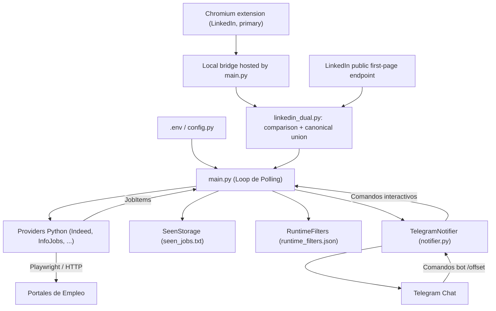

# Architecture

## Visión General
El sistema opera en un ciclo de polling continuo que extrae ofertas de trabajo desde portales configurados, normaliza la información, filtra duplicados y palabras clave, y envía alertas enriquecidas mediante Telegram.

## Componentes Clave

1. **`main.py` (Orquestador Central):**
   - Controla intervalos de sueño con jitter (`REGULAR_SLEEP_SECONDS`, `FIRST_TO_SECOND_SLEEP_SECONDS`).
   - Ejecuta proveedores habilitados secuencialmente o con reintentos configurables.
   - Atiende comandos interactivos recibidos vía Telegram (`process_telegram_commands`).
   - Gestiona limpieza diaria programada de almacenamiento y archivos de debug (`DAILY_SEEN_CLEANUP_HOUR`).
   - Registra métricas de ejecución en `data/provider_metrics.csv`.

2. **Capa de Proveedores (`providers/`):**
   - `JobProvider` (Protocol base): Define la interfaz de extracción `fetch_jobs(config, context) -> list[JobItem]`.
   - `LinkedInProvider` (`linkedin.py`): lector público de una única primera
     página por URL configurada. Conserva la consulta exactamente como está y
     devuelve tarjetas brutas con estado HTTP/parseo, sin decidir relevancia.
   - `IndeedProvider` (`indeed.py`): Extracción HTML directa o vía Playwright headless según configuración.
   - `InfoJobsProvider` (`infojobs.py`): Soporta gestión de cookies, paginación configurable y scrolls defensivos.

3. **Almacenamiento y Deduplicación (`storage.py`):**
   - `SeenStorage`: Lectura/escritura atómica de IDs en `data/seen_jobs.txt`.
   - Formato de clave: `{provider}:{id}`.

4. **Notificaciones y Control Telegram (`notifier.py`):**
   - Envío de mensajes formateados (HTML/Markdown).
   - Mecanismo de lectura de updates para comandos remotos (como añadir filtros o consultar estado).

5. **Extensión & Puente Local (`extension_bridge.py` & `extension/`):**
   - En el modo de Raspberry dedicada, Chromium carga una sesión persistente y
     la extensión desplaza la lista virtualizada hasta que el final, el número
     de tarjetas y la altura permanecen estables. Envía un lote v2 con `run_id`,
     URL, tarjetas y diagnóstico por búsqueda; un scroll incompleto es
     `partial`, no un éxito.
   - La extensión publica sólo en `127.0.0.1`. Por cada lote, el bridge llama
     al lector público equivalente, normaliza ambas fuentes al ID canónico de
     LinkedIn y entrega su unión una sola vez a `process_jobs`. Los inventarios
     y discrepancias se conservan en `data/linkedin_runs.jsonl`.
   - La extensión es primaria. Tras dos intervalos sin un lote completo, el
     scheduler usa la API como respaldo degradado; una posterior pasada completa
     de extensión restablece la comparación dual. La guía está en
     `docs/RASPBERRY_PI_SETUP.md`.

## Puntos Sensibles
- **Manejo de Sesiones y Antidetección:** Las cookies y perfiles en `data/*_session` deben mantenerse aislados. Modificaciones en selectores DOM requieren validación defensiva para no romper el ciclo si los portales cambian su frontend.
- **Entrega de Notificaciones:** `MAX_NOTIFS_PER_CYCLE=0` envía todas las ofertas elegibles y no vistas dentro del mismo ciclo. Un valor positivo activa un tope explícito por proveedor; `silent_on_start` evita el envío masivo al reiniciar cuando se desea.
